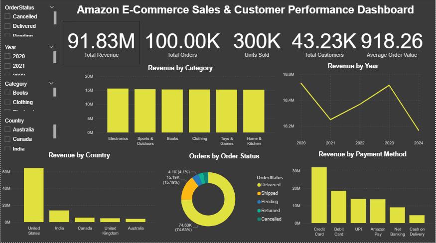
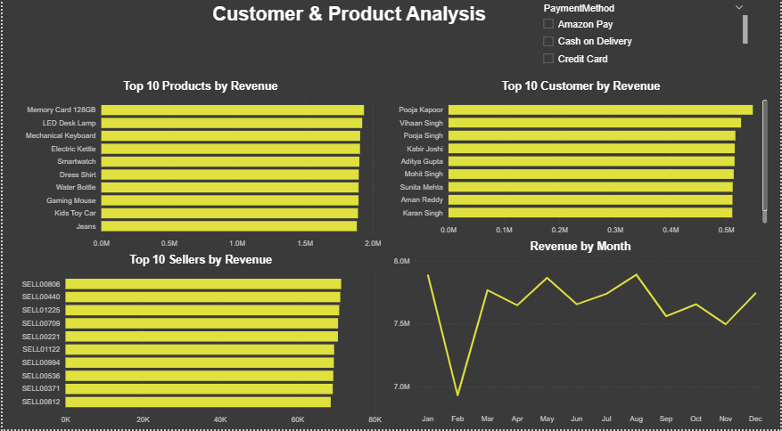

# Amazon E-Commerce Sales & Customer Performance Analysis

## Project Overview

This project analyzes 100,000 Amazon e-commerce transactions to uncover insights into sales performance, customer behavior, product performance, seller performance, and payment methods.

The analysis was performed using Microsoft SQL Server for data exploration and analysis, and Microsoft Power BI for interactive dashboard visualization.

The project demonstrates my ability to clean, analyze, query, and visualize large datasets to generate meaningful business insights.


## Tools & Technologies

- **Microsoft SQL Server** — Data analysis and SQL querying
- **Power BI** — Interactive dashboard and data visualization
- **Microsoft Excel** — Source dataset
- **GitHub** — Project documentation and portfolio sharing


## Business Questions

This analysis aims to answer the following questions:

1. What is the overall sales revenue and average order value?
2. How does revenue change from year to year?
3. Which product categories generate the most revenue?
4. Which products are the top revenue generators?
5. Who are the highest-spending customers?
6. How many customers are repeat customers?
7. Which sellers generate the most revenue?
8. Which countries and cities generate the most sales?
9. Which payment methods are most commonly used?
10. What is the distribution of order statuses?
11. Which months generate the highest and lowest revenue?


## Key Insights

### Sales Performance

- Total revenue generated was **$91.83 million** across **100,000 orders**.
- Average order value was approximately **$918.26**.
- Sales remained relatively stable across the five-year period from **2020 to 2024**, with annual revenue staying around $18 million.
- **August** recorded the highest monthly revenue at approximately **$7.89 million**.
- **February** recorded the lowest monthly revenue at approximately **$6.93 million**.

### Customer Performance

- The dataset contains **43,233 unique customers**.
- **29,701 customers** made more than one purchase.
- This means approximately **68.7% of customers were repeat customers**.
- The customer order distribution shows that most repeat customers placed **2–3 orders**.

### Product & Category Performance

- **Electronics** generated the highest category revenue at approximately **$15.58 million**.
- **Clothing** had the highest revenue per unit at approximately **$308.01**.
- The revenue difference between categories was relatively small, indicating fairly balanced category performance.
- The highest-revenue product in the analysis was **Memory Card 128GB**, generating approximately **$1.94 million**.

### Seller Performance

- The dataset contains **1,999 sellers**.
- The highest-revenue seller in the analysis was **SELL00806**, generating approximately **$71,283.67**.
- The top 10 sellers generated approximately **$699,898.80**, representing about **0.76% of total revenue**.
- This indicates that seller revenue is widely distributed across the marketplace.

### Geographic Performance

- The **United States** generated the highest revenue at approximately **$64.31 million**.
- **India** was the second-largest market with approximately **$13.88 million** in revenue.
- Dallas was among the highest-revenue cities, generating approximately **$3.30 million**.

### Payment & Order Performance

- **Credit Card** was the highest-revenue payment method, generating approximately **$32.12 million**.
- **Delivered** orders represented the largest order-status group, with **74,628 orders**.
- Returned and cancelled orders accounted for a smaller portion of total orders.


## SQL Analysis

The dataset was analyzed using Microsoft SQL Server.

Key SQL analyses included:

- Data validation and row count checks
- Unique customer and order analysis
- Missing-value checks
- Total revenue and average order value
- Revenue by year and month
- Top customers by revenue
- Repeat customer analysis
- Customer order frequency
- Top products by revenue
- Category performance
- Seller performance
- Revenue by country and city
- Payment method analysis
- Order status analysis

A SQL view named `vw_AmazonSales` was created to provide a clean data source for the Power BI dashboard.

The complete SQL script is available in:

`Amazon_Sales_Analysis.sql`


## Power BI Dashboard

The SQL-analyzed data was connected to Microsoft Power BI to create an interactive two-page dashboard.

### Page 1 — Executive Dashboard

The first page provides an overview of business performance, including:

- Total Revenue
- Total Orders
- Units Sold
- Total Customers
- Average Order Value
- Revenue by Year
- Revenue by Category
- Revenue by Country
- Revenue by Payment Method
- Orders by Order Status

Interactive slicers allow users to filter the dashboard by:

- Year
- Category
- Country

### Page 2 — Customer & Product Analysis

The second page focuses on customer, product, and seller performance.

It includes:

- Top 10 Products by Revenue
- Top 10 Customers by Revenue
- Top 10 Sellers by Revenue
- Revenue by Month
- Payment Method analysis
- Order Status analysis

The dashboard allows users to interact with the data and explore performance across different dimensions.


## Dataset

The dataset used in this project is the **Amazon Sales Dataset**, obtained from Kaggle.

The dataset contains **100,000 e-commerce transactions** and 20 columns covering orders, customers, products, sellers, payments, locations, and order status.

Dataset source:

[Kaggle — Amazon Sales Dataset](https://www.kaggle.com/datasets/rohiteng/amazon-sales-dataset)

The original dataset is included in this repository as:

`Amazon.xlsx`

The dataset is used for educational and portfolio analysis purposes. Please refer to the original Kaggle dataset page for the current license and attribution requirements.


## Project Structure

```text
Amazon-Ecommerce-Sales-Analysis/
│
├── Amazon.xlsx
├── Amazon_Sales_Analysis.sql
├── Amazon_Ecommerce_Sales_Analysis.pbix
├── Page1_Dashboard.png
├── Page2_Customer_Product.png
└── README.md

## Skills Demonstrated

- SQL data analysis
- Data validation and quality checks
- Aggregation and grouping
- Customer segmentation and behavior analysis
- Sales and revenue analysis
- Product and category analysis
- Seller performance analysis
- Geographic analysis
- Power BI dashboard development
- Data visualization
- Business insight generation
- Data storytelling


```markdown
## Dashboard Preview

### Executive Dashboard



### Customer & Product Analysis


